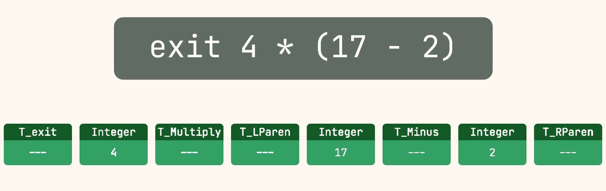
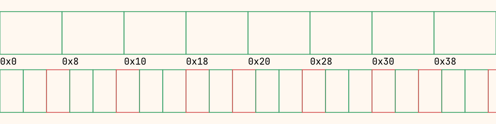
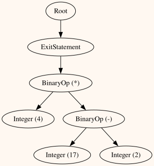
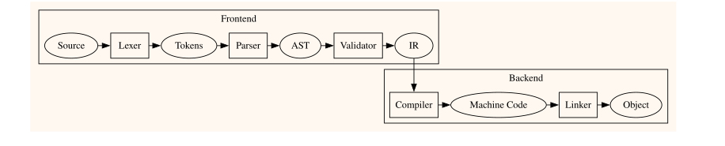

15 min read

Hello all! And welcome to the part where I actually start explaining the things I've done :)

Admittedly, it has been *looks at calendar*... a little while since the last post. This is partially due to good old life and work busy-ness, partially due to working on finalizing the previous update of the language, and partially due to that update getting a surprise re-design and total overhaul of the register allocation system out of necessity (*edit*, I am now at two updates with surprise re-designs of the register allocation). Who can say which one had a greater impact though? I promise I have not forgotten about you, hypothetical reader, and it was in the name of absolutely cooking.

In this post I'm going to "very quickly" walk through everything I did to get to the first version (0.1) of the language which, as you may or may not remember, was only a glorified calculator. So grab your tea, coffee or other caffeinated beverage (if you're into that sorta thing) and strap in, because this one is a bit of a doozy.

## Stage 1: Lexing

Lexing/tokenizing/lexical analysis/character grouping (or whatever you want to call it) involves the process of reading in characters from a source file and processing them into discrete units, which are often called tokens or lexemes (these are technically different, but commonly used interchangeably -- I will use "tokens" to simplify things).
Tokens are then represented in code by a type (enum), and for certain types of token – such as strings, names or numbers – the token value as a string.

Although this stage of a compiler is conceptually (and technically) very simple, for whatever reason, I chose to implement this stage as hard-coded string and character comparisons on a small, rotating input buffer of characters which are read in from the source file.
Despite the extra overhead for little to no advantage, it at least supports the 2 major operations required, which are *advancing* (requesting the next input character from the file and incrementing the size of the input) and *consuming* (reducing the size of the input to 1 such that it leaves only the most recently read character in the buffer).



Each token produced also has additional information along-side it, namely the line + column it corresponds to in the source file as well as its size (in bytes). These are not necessary for any stage of the compiler, but greatly simplify the error generation process during parsing (and validation) since the information is readily available.

```c
struct _token
{
    /* The raw string value corresponding to this token */
    const char *value;
    /* The line where this token starts in the source file */
    uint32_t line;
    /* The column where this token starts in the source file */
    uint32_t column;
    /* The size of the token string in the source file */
    uint32_t size;
    /* The type of this token */
    token_type_t type;
};
```
Anyone who knows anything about CPU caches will see this and probably want to vomit. Each token occupies 24 bytes of space and cache lines are (almost always) 64 bytes in size, meaning every 2 and a bit tokens will cause a cache miss, which is really not efficient and will inevitably slow down parsing, which needs to iterate through these tokens.



Although one would assume this is painfully slow, the compiler is able to fully translate and link reasonably sized (100-200 line) source files in the magnitude of a few 10s of ms at most (on my beefy machine at least -- results may vary), and the convenience of having all of the necessary information readily availble as part of the token itself has far outweighed the desire to make compiler go brrrr, so it has stayed.

Despite the ridiculous over-engineering and questionable design choices, it works and it works fast enough to not be an issue to this day. It also helps that adding new token identification to the system is extremely simple for keywords and relatively simple for anything more complex, which has been far more valuable than performance or good design, and the reason it hasn't been completely reworked *yet*... *I'm coming for you one day though*.<br>
It should be noted, however, that this design was originally taken from my first attempt at creating a programming language, when I was but a slightly more naive little programmer, and since it ain't broke, I haven't fixed it.
> Note: This is my design philosophy for nearly everything. I find it surprisingly effective

## Stage 2: Parsing

Parsing/syntactic analysis (this has less names than the first stage in my experience) aims to take the list of tokens produced by the first stage and do two things.<br>
1: Verify the grammatical structure of the language and 2: Produce an Abstract Syntax Tree (henceforth shortened to AST) to be later validated in its own right.

Verifying the grammatical structure requires, you know... a grammar. This is where the complexity of languages and language design really begin. There are many types of formal grammars and corresponding parsing techniques which can be applied, however I opted for (arguably) the easiest of each.

My language's grammar is written in a slightly modified [Backus-Naur form](https://en.wikipedia.org/wiki/Backus%E2%80%93Naur_form) and is "context-free", meaning the context of evaluating a non-terminal is irrelevant to how that non-terminal is evaluated. What is a non-terminal? It's some made up part of your language which is made up of other smaller things, known as terminals (and often other non-terminals too). What is a terminal then? Just a token of a given type and nothing more.

This is how you can define structure in your language, such as a function being made up of a keyword, name, list of parameters and return value in that order, for example:
```
<Function> ::= TOKEN_FN TOKEN_NAME <ParameterList> <ReturnValue>
<ParameterList> ::= ...
<ReturnValue> ::= ...
```

What this means is that anytime a `<Function>` non-terminal is encountered while parsing, it should be replaced (regardless of context) with the following list of terminals and non-terminals, which represent the expected tokens in the token list. This type of grammar is technically known as an "LL Grammar", which means that you parse in a top-down like fashion, starting with some root-level non-terminal and expanding things down and down until either an error is encountered (for example, a `TOKEN_FN` not followed by a `TOKEN_NAME`), or the entirety of the token list has been correctly parsed.

The biggest benefit of this type of grammar in my opinion, and why I chose it, is that it can very easily be implemented by hand using something known as "recursive-descent", which is a fancy term meaning the parsing implementation for each non-terminal in the grammar directly corresponds to a function in code. Instead of "replacing" a non-terminal with its derivation (the things to the right of the `::=`), you just call the non-terminal function, with each non-terminal function being responsible for verifying its own derivation.

The only thing this requires as shared parsing state is the list of input tokens provided by the previous stage, as well as the index of the next token to be evaluated. Each terminal "consumed" by a non-terminal's derivation then simply increments this index and parsing continues.

Verifying the input against a grammar is fairly easy. What's slightly harder is generating an AST from this input. The AST aims to emulate the structure of the language in its tree-like representation, where generally speaking, each non-terminal corresponds to a node in the tree and each terminal corresponds to a leaf node.

For those curious, here is the initial grammar used for the language
```
VERSION 0.1.0 (language fundamentals):
Root                                := StatementList
StatementList                       := Statement StatementList | e
Statement                           := T_exit Expression
Expression                          := MultiplicationExpression ((T_Plus | T_Minus) MultiplicationExpression)*
MultiplicationExpression            := CoreExpression ((T_Multiply | T_Divide | T_Modulus) CoreExpression)*
CoreExpression                      := T_Parenthesis_Left Expression T_Parenthesis_Right | T_Literal_Integer
```

Applying that grammar to the input used above, we get the following (simplified) AST:<br>


## Stage 3: Validation (Semantic Analysis)

This stage (semantic analysis formally, but I call it validation) is similar to the last in that it has two goals. The first is analysing the AST and ensuring that the resulting program will operate as expected/correctly. Although this is an admittedly vague description, that's because it is a vague goal. For all statically-typed languages, this involves type checking -- making sure the types of variables, fields, values, etc. are valid given their use -- but may also include type inference, bounds checking, or in the case of Rust for example, borrow checking.

This is where the majority of language work happens, however for my extremely simple initial language, nothing was being checked except that integer literals would fit within a signed 64-bit integer. There was nothing else to check without checking for overflow from arithmetic operations, which seemed like extremely heavy overkill for what was effectively a prototype language at the time.

This then leaves us with the second goal of this stage, which is to produce some form of intermediate representation (IR) corresponding to the AST, which is a platform agnostic representation of the program and can be compiled into machine code later on. At this point, many new languages will wisely opt to link with LLVM and produce LLVM IR bytecode, which can then be compiled and linked by the LLVM backend into a working executable.

I, however, opted not to do this -- partially as a learning experience, partially as a middle finger at needing C bindings for something written in C++, and more partially because it was (and still is) well known that LLVM can be quite slow ([who could possibly say why that is?](https://llvm.org/doxygen/inherits.html)).

And so, instead, I opted for producing my own custom three-address code intermediate representation from the AST, which is all that my validation stage really did.

## Stage 3.5: Intermediate Representation

The goal of an intermediate representation is to abstract away machine details, but otherwise provide a low-enough-level sequence of instructions (and corresponding arguments) such that the resulting machine code can be easily produced by the actual "compilation" part of the compiler (with everything up to that being what I would consider "translation").

One such common (and extremely simple) type of intermediate representation is known as "[three-address-code](https://en.wikipedia.org/wiki/Three-address_code)", where each instruction typically consists of an output, an operation, and two arguments. This would be stored in an array and processed linearly by the compilation stage to produce the corresponding output.

Since variables were not supported initially (don't worry, Klack has them now), each operation was assumed to output to a register. Each argument was also either a register resulting from a previous instruction, or an "immediate" (a literal integer value). Operations were of course one of an enum value corresponding to the supported arithmetic operations. And thus, we have a three-address-code IR:
```c
struct _ir_entry
{
    /* The type of this IR entry */
    ir_entry_type_t type;
    /* The type of the first argument */
    ir_arg_type_t arg1_type;
    /* The type of the second argument */
    ir_arg_type_t arg2_type;
    /* The data for the first argument */
    ir_arg_data_t arg1_data;
    /* The data for the second argument */
    ir_arg_data_t arg2_data;
};

struct _ir
{
    /* The array of IR entries stored in this IR table */
    array_t *ir_entries;
};
```

For example, the following simple code would be translated to the IR entries below
```
exit 4 * (17 - 2)
```

| Index | Type | Arg1-Type | Arg2-Type | Arg1-Data | Arg2-Data |
|------:|-----:|----------:|----------:|----------:|----------:|
| 000 | Subtract | Integer S64 | Integer S64 | "17" | "2" |
| 001 | Multiply | Integer S64 | IR Entry | "4" | [000] |
| 002 | Exit | IR Entry | --- | [001] | --- |

## Stage 4: Compilation! (finally)

Finally we get to the part of the compiler that, in my opinion, actually does the compiling. As previously mentioned, this stage simply iterates through the IR instructions and outputs the corresponding machine code, however there is technically a mini-stage which must be done before actually outputting the instructions, which is known as "register allocation". Typically, what happens in this stage is that all places where registers are needed in the intermediate representation have registers populated by some external register allocation algorithm, and the combination of allocated registers and IR are used for the compiled output. In the example above, this would need to determine which registers are used as outputs by instruction `[000]` and `[001]`, as well as for their integer arguments, if necessary.

Unfortunately, this is not such an easy thing to do, and it wasn't really necessary for the very limited IR that was initially supported, so registers for each instruction were *gasp* hard-coded. I know, I know, but not wasting time implementing a system which wasn't necessary made it, unsurprisingly, easier to do the rest of the necessary stuff.

Each of the above IR entries (or "instructions" as they're colloquially known) goes through a switch statement which would either output an "arithmetic entry" for any of the arithmetic IR instructions, or the platform-specific "exit entry", which was if-def'd to match the host platform being compiled for (that's right, Windows ***AND*** Linux supported from the get-go).

The "arithmetic entry" output would move its arguments into the expected registers (hard-coded as RAX and RBX for everything), followed by a REX.W prefix (which is x86_64 for "make this 64-bits please"), since only 64-bit signed integers were supported at the time, and then the actual instruction bytes would be output. Where was this all written to you ask? Just a regular degular C `FILE *`.
> For anyone trying to do something similar, [this website](https://www.felixcloutier.com/x86/) (in combination with official documentation) may become your best friend.

On linux, "exiting" can be done via a syscall, specifically by setting the RAX register to [60](https://www.chromium.org/chromium-os/developer-library/reference/linux-constants/syscalls/#x86_64_60) and passing the exit code in the RDI register. This was fairly easy to implement since `syscall` is just an x86_64 instruction, and moving values into registers is mostly trivial.<br>
On Windows, it is not so easy. To "exit", you must call the `ExitProcess()` function found in `kernel32.dll`. This requires not just outputting a `call` x86_64 instruction, but also **dynamically linking** to a function and updating the called address to match the linked function address. This requires adding additional sections to the resulting PE file, implementing an entire additional system to enable relocations (things which need to be updated after initial output) and a bunch of ugliness. 0/10, would not recommend.

At this point, we have an output file containing the machine code for the given source file. Already a lot of work has been done to translate it this far, but we still have one more step left -- turning this compiled machine code into an executable file.

## Stage 5: Output

To very heavily generalize, an executable is made up of headers which describe various details about the file and where certain parts of it can be found. These parts typically include other sections/headers describing where more specific details can be found in the file contents, and segments/code which describe which part of the file should be loaded into memory and treated as code.

The machine code we got from the previous stage will get moved around in the file and eventually referred to by the top-level header, which must instruct the operating system where to begin execution in the file once it has been loaded into memory (think of this as "main" for all intents and purposes).

This stage effectively just builds up the scaffolding surrounding the machine code and sets the entry point to it. Although it may sound relatively simple, I promise... it was not. Especially not on Windows.

I'm just going to list some references here that helped me figure this part out. There was a lot of reading documentation combined with reverse engineering to eventually produce an executable ELF file and a PE file for Linux and Windows respectively. I may or may not dive deeper into these file formats in a future blog post, but this part is the least fun and interesting in my opinion.

[PE format (official)](https://learn.microsoft.com/en-us/windows/win32/debug/pe-format)<br>
[ELF example](https://github.com/corkami/pics/blob/master/binary/elf101/elf101.pdf)

## Stage 0: AKA, tying it all together

Generally speaking, a compiler can be viewed as a sort of pipeline, where source code gets input into the lexer and output as a list of tokens. This then gets fed into the parser which outputs an abstract syntax tree. This AST is then processed by the validator and produces an intermediate representation, and finally, output to machine code, where it can be linked and turned into an executable, archive or dynamic library (or just an object if undecisive).



As beautiful as this pipeline idea is (both in theory and in practice), *something* needs to actually make it happen. This is commonly known as a "driver" in compiler lingo and is what actually gets run when you run `gcc` or `clang` or `rustc`. This will typically orchestrate the pipeline you see above, handling input arguments, deciding what to do if there are errors, etc.

During my initial implementation, this idea was called a "translation instance", and it facilitated the ordered execution of each stage of the pipeline, passing the outputs from the previous stage as the input into the next one. The only thing it didn't handle was processing the input arguments to the program to determine the source file to compile. This was handled separately by a "compiler instance", which was really just one function, and given to the translation instance to deal with.

## Stage ?: How much of this design was kept?

In short, only the lexer and parser design have been sufficient for everything up until now. Although those two stages may be changed in the future for optimization reasons, their design is flexible enough to handle everything I can currently foresee needing.

The same cannot be said for all other stages and their supporting data structures, which have undergone massive rewrites (some even multiple times) to accommodate the changes necessary for getting the language to where it is today. Each of these design changes/rewrites will be addressed in their corresponding blog posts when the time comes, both as historical preservation, but also as a place to document why I did the things I did (however misguided I may have been).

I hope this blog post was informative, and midly entertaining? Anyways, that's how the language started, but it has come a long long way from there. I know this blog post probably did not make the functionality of any stage particularly clear, as most things were only loosely covered for brevity, but rest assured that they will likely all have their own focused posts in the future.


The next blog post will cover the next version of the language (v0.2), which added variables and assignment operators to the language, finally starting to move away from the calculator of the initial version. Hope to see you there and thanks for reading! :)
